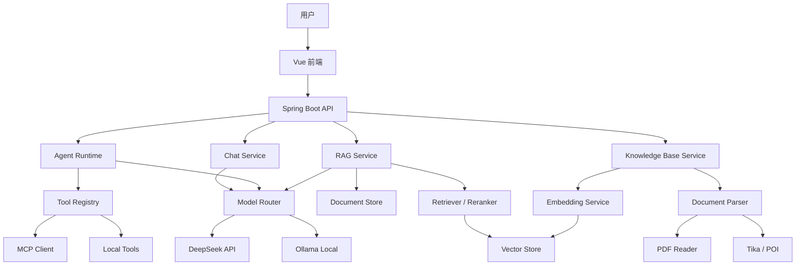
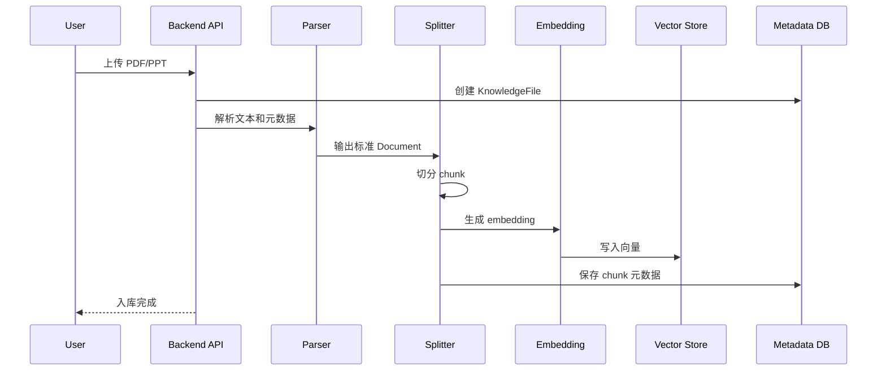
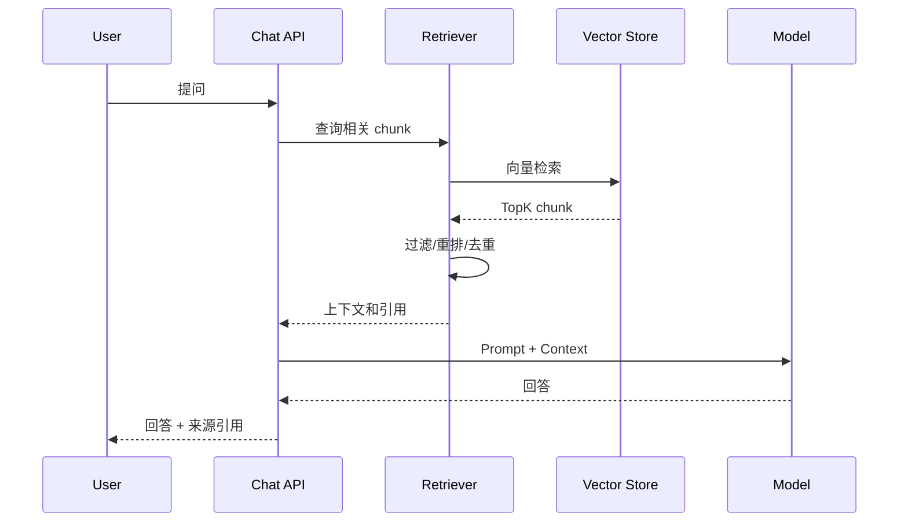
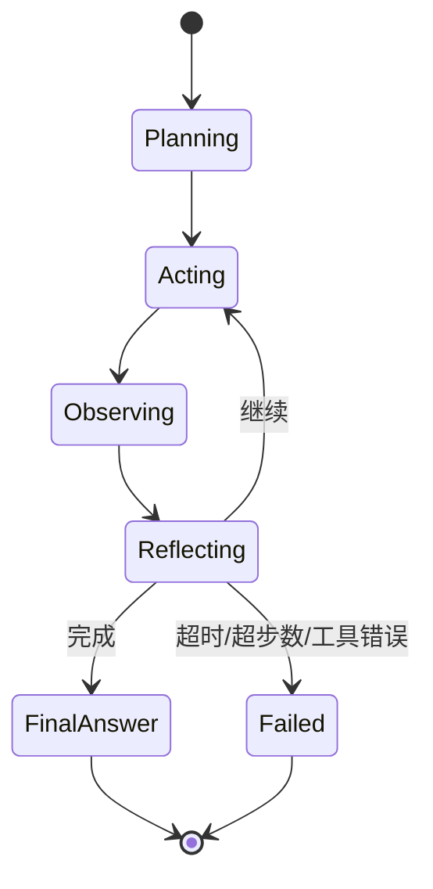

# 技术架构文档

## 1. 技术栈约束

### 后端

- Java: 21
- Framework: Spring Boot 4.x
- AI Framework: Spring AI 2.0 GA，统一以 https://docs.spring.io/spring-ai/reference/index.html 为准
- Build: Maven 或 Gradle，建议首期 Maven，便于 Spring 生态依赖管理
- Database: PostgreSQL 或 MySQL
- Vector Store: PostgreSQL + pgvector、Milvus、Qdrant、Elasticsearch 向量能力待选
- Cache: Redis，可后置
- Storage: 本地文件系统首期，后续可扩展 MinIO / OSS

说明：

- Spring Boot 4.x 最低要求 Java 17+；本项目统一使用 JDK 21 作为开发、编译和运行基线。
- Spring AI 不引用 2.0-SNAPSHOT 文档。所有 API、依赖和示例以 2.0 GA Reference 为准。
- 使用 Spring AI BOM 管理版本，避免手写 Spring AI 相关依赖版本。
- Spring AI 2.0 GA 是当前项目开发基线。

### Spring AI 2.0 GA API 基线

当前文档按 Spring AI 2.0 GA Reference 约束，关键能力采用以下 API 思路：

- ChatClient：作为平台统一聊天入口，普通问答、RAG 和工具调用都优先通过 ChatClient 组织。
- Tool Calling：优先使用 ChatClient 的 `.tools(...)` 方式交给 Spring AI 管理工具调用生命周期；平台侧维护 ToolRegistry、工具白名单和执行日志。
- MCP：MCP 工具通过 `ToolCallbackProvider` / `SyncMcpToolCallbackProvider` 暴露给 ChatClient 或 ChatModel，不直接绑定到业务代码。
- RAG：简单知识库问答可使用 `QuestionAnswerAdvisor`；复杂查询改写、过滤和检索增强可使用 `RetrievalAugmentationAdvisor`、`VectorStoreDocumentRetriever` 等稳定版 Advisor 能力。
- ETL：文档入库采用 DocumentReader、DocumentTransformer、DocumentWriter 思路；PDF 使用 `spring-ai-pdf-document-reader`，切分后写入 VectorStore。
- VectorStore：通过 Spring AI VectorStore 抽象访问向量库，业务层不直接依赖具体向量数据库 SDK。

### 前端

- Framework: Vue
- Language: TypeScript
- Build: Vite
- State: Pinia
- Router: Vue Router
- UI: Element Plus 或 Naive UI，建议 Element Plus，偏后台管理和学习平台
- Markdown: markdown-it / Shiki / KaTeX 按需引入

前端设计必须遵循 [前端设计规范](05-frontend-design-guidelines.md)。页面实现时不要直接套用组件库默认风格，应在智能体工作台、知识库管理、RAG 调试和 Agent 轨迹场景下做项目化设计。

### 模型

- 云模型：DeepSeek，当前项目统一使用官方新命名 `deepseek-v4-flash` 和 `deepseek-v4-pro`。
- 本地模型：阶段 0 暂不接入 Ollama。
- 模型路由：通过 ModelProvider 抽象统一 ChatModel、EmbeddingModel 和 Tool Calling 能力。

模型用途建议：

- `deepseek-v4-flash`：默认对话、RAG 问答、低延迟和成本敏感场景。
- `deepseek-v4-pro`：复杂推理、计划、反思、LeManus 多步任务。
- Ollama 本地模型：隐私数据、本地实验、离线开发，后续阶段接入。

## 2. 总体架构



## 3. 后端模块拆分

建议按能力而不是按技术堆叠拆包。

```text
com.gewu.agent
  common          # 通用响应、异常、日志、分页、配置
  user            # 用户与身份，首期可简化
  model           # 模型配置、模型路由、token 统计
  chat            # 会话、消息、流式响应
  knowledge       # 知识库、文件、文档元数据
  ingestion       # 文档解析、切分、embedding、索引构建
  rag             # 检索、重排、上下文组装、引用生成
  agent           # 智能体定义、运行时、ReAct loop
  tool            # Tool Calling、本地工具、工具注册表
  mcp             # MCP client/server 集成
  evaluation      # 问答评测集、召回评测、人工反馈
```

## 4. 核心领域模型

| 实体 | 说明 |
| --- | --- |
| AgentDefinition | 智能体定义：名称、头像、系统提示词、模型配置、知识库绑定、工具白名单 |
| Conversation | 一次用户和智能体的会话 |
| Message | 会话消息，包含角色、内容、token、引用、工具调用 |
| KnowledgeBase | 知识库，例如“面试鸭知识库”“408 操作系统” |
| KnowledgeFile | 上传的原始文件 |
| DocumentChunk | 切分后的知识片段 |
| EmbeddingRecord | 向量记录，与 chunk 绑定 |
| ToolDefinition | 工具定义，包括参数 schema、权限、超时 |
| AgentRun | 一次智能体执行过程 |
| AgentStep | ReAct 中的一步 Reason/Act/Observe/Reflect |
| EvaluationCase | 固定评测问题与期望答案 |

## 5. RAG 数据流

### 文档入库



### 问答检索



## 6. 向量数据库选型

| 方案 | 优点 | 缺点 | 建议 |
| --- | --- | --- | --- |
| PostgreSQL + pgvector | 和业务库合并，部署简单，适合个人项目 | 极大规模和高级向量能力不如专用库 | 首选 |
| Qdrant | 向量检索体验好，部署轻量，过滤能力强 | 需要额外服务 | 如果想展示专业向量库，可选 |
| Milvus | 大规模向量场景强 | 部署复杂 | 暂不建议首期 |
| Elasticsearch/OpenSearch | 文本检索和向量混合能力强 | 配置复杂，占资源 | 后续做混合检索再考虑 |

首期推荐：PostgreSQL + pgvector。理由是个人项目更看重可落地、可维护、可展示完整闭环。

## 7. 文档解析策略

| 文件类型 | 首期方案 | 增强方案 |
| --- | --- | --- |
| PDF | Spring AI PDF Document Reader | PDFBox 定制页码、目录、表格 |
| PPT/PPTX | Apache Tika 统一抽取文本 | Apache POI 抽取 slide、shape、notes、图片 |
| DOCX | Apache Tika | Apache POI XWPF |
| Markdown/TXT | 直接解析 | 保留标题层级 |

统一输出：

```json
{
  "sourceType": "PDF",
  "fileName": "408-os.pdf",
  "pageOrSlide": "12",
  "section": "进程管理",
  "text": "片段文本",
  "metadata": {
    "course": "操作系统",
    "tags": ["408", "进程"]
  }
}
```

## 8. Agent Runtime 设计

LeManus 建议实现成可调试的状态机。



核心接口：

```java
public interface AgentRuntime {
    AgentRunResult run(AgentRunRequest request);
}

public interface AgentTool {
    String name();
    ToolResult call(ToolCallRequest request);
}

public interface KnowledgeRetriever {
    List<RetrievedChunk> retrieve(RetrieveRequest request);
}
```

## 9. Tool Calling 与 MCP

Spring AI 2.0 GA 支持通过 ChatClient 传入工具，让框架管理工具调用生命周期。平台内应抽象 ToolRegistry：

- LocalTool：Java 代码内实现，例如知识库检索、时间、文件摘要。
- McpTool：来自 MCP Server 的工具。
- RemoteTool：HTTP API 工具，默认不开放。

安全约束：

- 每个智能体只允许使用白名单工具。
- 工具必须声明参数 schema。
- 工具调用必须记录日志。
- 文件/网络/命令类工具默认关闭。
- 每轮 Agent 有最大步数和总超时。

## 10. API 草案

| 方法 | 路径 | 说明 |
| --- | --- | --- |
| GET | /api/agents | 智能体列表 |
| POST | /api/agents | 创建智能体 |
| POST | /api/chat/stream | 流式聊天 |
| GET | /api/conversations | 会话列表 |
| POST | /api/knowledge-bases | 创建知识库 |
| POST | /api/knowledge-bases/{id}/files | 上传文件 |
| POST | /api/files/{id}/index | 重建索引 |
| GET | /api/files/{id}/chunks | 查看切片 |
| POST | /api/rag/retrieve | 调试检索结果 |
| POST | /api/agent-runs | 执行 LeManus |
| GET | /api/agent-runs/{id}/steps | 查看执行轨迹 |

## 11. 前端页面

| 页面 | 功能 |
| --- | --- |
| 智能体工作台 | 左侧智能体列表，中间聊天，右侧引用/工具轨迹 |
| 知识库管理 | 知识库、文件、入库状态、重建索引 |
| 文档切片调试 | 查看 chunk、元数据、embedding 状态 |
| Agent 调试台 | 查看 LeManus 每一步 Reason/Act/Observe |
| 模型配置 | DeepSeek/Ollama 配置、默认模型、温度、token 限制 |
| 评测中心 | 固定问题集、回答结果、召回片段、人工评分 |

## 12. 参考资料

- Spring AI 2.0 GA Reference: https://docs.spring.io/spring-ai/reference/index.html
- Spring AI Tool Calling: https://docs.spring.io/spring-ai/reference/api/tools.html
- Spring AI ETL / PDF Reader: https://docs.spring.io/spring-ai/reference/api/etl-pipeline.html
- Spring AI RAG: https://docs.spring.io/spring-ai/reference/api/retrieval-augmented-generation.html
- Spring AI MCP: https://docs.spring.io/spring-ai/reference/api/mcp/mcp-overview.html
- Spring Boot System Requirements: https://docs.spring.io/spring-boot/system-requirements.html
- Apache Tika: https://tika.apache.org/
- Apache POI: https://poi.apache.org/
- Ollama API: https://github.com/ollama/ollama/blob/main/docs/api.md
